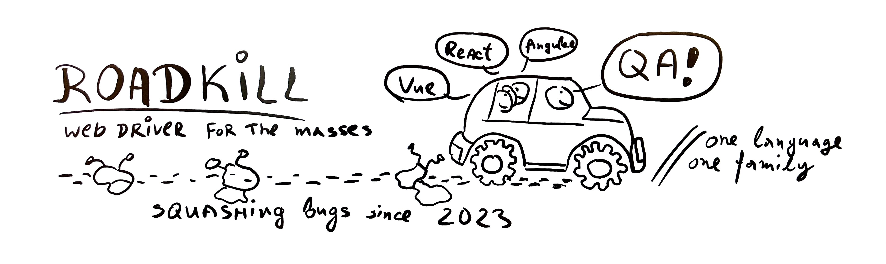

# Roadkill
> A WebDriver for the masses!



***Version: Alpha!***

A [node.js](https://nodejs.org/en) testing solution over the [WebDriver](https://www.w3.org/TR/webdriver2/) protocol. Will also consider [WebDriver BiDi](https://w3c.github.io/webdriver-bidi/).

Powered by:
 - [TypeScript](https://www.typescriptlang.org)
 - [Promise based](https://developer.mozilla.org/en-US/docs/Web/JavaScript/Reference/Global_Objects/Promise)
 - [Errors with causes](https://developer.mozilla.org/en-US/docs/Web/JavaScript/Reference/Global_Objects/Error/cause)
 - [AbortSignals](https://developer.mozilla.org/en-US/docs/Web/API/AbortSignal)
 - all the fancy tech...

A [WebDriver](https://www.w3.org/TR/webdriver2/) based slim testing framework. Closes the gaps between QAs and Front-End developers by:

 - Sharing the same TypeScript or JavaScript language with ***Angular***, ***React*** and ***Vue*** front-end developers
 - Stay within the [nodejs](https://nodejs.org/en) ecosystem
 - Skill-transfer between QAs and Front-End devs
 - Share the lightweight VSCode IDE
 - Compile-time type-checking

## Demo
To run the demo code, clone the repo, execute the ***[./packages/@progress/roadkill/example.ts](./packages/@progress/roadkill/example.ts)*** by running:
```
npm run example
```

### About @progress/roadkill/webdriver
The webdriver implementation steps on nodejs v18.17.1, uses TypeScript, and follows the webdriver spec as close as possible.

Each webdriver command, is implemented as a function or a class method, invoking an underlying fetch request. The parameters to these methods has been described 1:1 by the spec using TypeScript interfaces providing compile time type checking and smart suggestions in the VSCode IDE. The webdriver connection, session and web elements are wrapped in classes, for better encapsulation. Documentation of methods is linked to the respective webdriver protocol, so they can be easily 1:1 mapped. The library provides only Promise based async methods, and while opinionated, allows good transparency of what happens under the hood of your tests.

### About @progress/roadkill/chromedriver
The ChromeDriver class can start a chromedriver locally, and listen for the chromedriver server to run on a localhost port. The service is also disposable shutting down the chromedriver process. Normally you will instantiate the ChromeDriver class and call `const address = await chromedriver.start();` in `beforeAll`, connect the `WebDriver` client to the ChromeDriver address, and on `afterAll` call `await chromedriver.dispose()`.

### AbortSignal
Node.js 18.17.1 supports AbortSignals, and each command can accept as a last argument an abort signal. You can interrupt your tests midway and still get a good callstack.

### Errors
Node.js now supports JavaScript hierarchical errors. See [Errors with causes](https://developer.mozilla.org/en-US/docs/Web/JavaScript/Reference/Global_Objects/Error/cause). This allows the API to wrap low-level errors with additional context and rethrow more meaningful high-level errors with full stack traces.

Example of a failing ***Find Element***, showing developer friendly top-level error, and detailed web driver low-level error:
```
WebDriverMethodError: Failed to find element by css selector "missing child", from element.
    at Element.findElement (/Users/cankov/git/telerik/roadkill/webdriver.ts:998:19)
    at process.processTicksAndRejections (node:internal/process/task_queues:95:5)
    at <anonymous> (/Users/cankov/git/telerik/roadkill/index.ts:70:1) {
  lookup: { using: 'css selector', value: 'missing child' },
  [cause]: WebDriverRequestError: no such element: no such element: Unable to locate element: {"method":"css selector","selector":"missing child"}
    (Session info: chrome=116.0.5845.140)
      at WebDriverClient.request (/Users/cankov/git/telerik/roadkill/webdriver.ts:499:23)
      at process.processTicksAndRejections (node:internal/process/task_queues:95:5)
      at Element.findElement (/Users/cankov/git/telerik/roadkill/webdriver.ts:996:20)
      at <anonymous> (/Users/cankov/git/telerik/roadkill/index.ts:70:1) {
    address: 'http://localhost:9542',
    sessionId: 'ff751c52ea3d9c15b11ca55308f97152',
    elementId: 'C034F7771093BB6022C302E050CC399E_element_13'
  }
}
```

Example of a failing ***Print Page*** on ***Safari***:
```
WebDriverMethodError: Failed to print page.
    at Session.printPage (/Users/cankov/git/telerik/roadkill/webdriver.ts:894:19)
    at process.processTicksAndRejections (node:internal/process/task_queues:95:5)
    at <anonymous> (/Users/cankov/git/telerik/roadkill/index.ts:89:24) {
  printOptions: { orientation: 'portrait', pageRanges: [ '1-2', '4-5' ] },
  [cause]: WebDriverRequestError: unknown command: The command 'POST /session/C751085A-3F88-452C-A0D1-B891FB9B0D34/print' was not found.
      at WebDriverClient.request (/Users/cankov/git/telerik/roadkill/webdriver.ts:499:23)
      at process.processTicksAndRejections (node:internal/process/task_queues:95:5)
      at Session.printPage (/Users/cankov/git/telerik/roadkill/webdriver.ts:892:20)
      at <anonymous> (/Users/cankov/git/telerik/roadkill/index.ts:89:24) {
    address: 'http://localhost:1550',
    sessionId: 'C751085A-3F88-452C-A0D1-B891FB9B0D34'
  }
}
```
